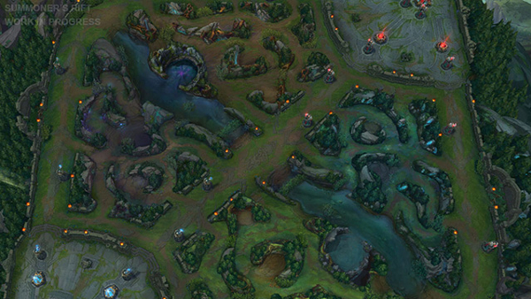

```{r setup, echo=FALSE}
knitr::opts_chunk$set(echo = TRUE, message = FALSE, warning = FALSE)
```

# Introduction
League of Legends is a multiplayer battle arena video game (MOBA) developed by Riot Games. In each game, there are two teams (red and blue) in which players are randomly placed. Each team starts on separate sides of the maps and the objective of the game is to destroy the enemy team’s nexus which is a structure in each of the team’s bases. Each team has five players who are each controlling a different character/champion that all have different abilities. Each champion starts out weak and increases in strength over the course of the game after accumulating experience, gold, and items. Players gain gold and experience from killing other players or killing monsters that are on the map. The monsters on the map may also provide unique buffs to the players for killing them. 



This is the map called Summoner’s Rift. There are three lanes that are defended by turrets for both teams. In between the lanes is the jungle where there are monsters that each team can kill. As you can see, each side is not exactly symmetrical. Different monsters are also located in different spots for each side. 

# Project Motivation
We recently got back into playing League of Legends because of the lack of things to do during the COVID-19 lockdown. We were curious to see if there was a difference in the win rate between each side and what are the best predictors of the win rate.

# The Data 
https://www.kaggle.com/bobbyscience/league-of-legends-diamond-ranked-games-10-min
This dataset that we retrieved from kaggle contains stats from the first 10 minutes of the game from approximately ten-thousand unique ranked games in Solo Queue from Diamond I to Master (which means that the players in the games are generally good players and are around the same skill level). The dataset has forty columns total (19 attributes for each team). These include gameID, win/loss, number of wards placed,  number of kills, number of deaths, first blood, number of assists, number of monsters killed, number of towers killed, total gold, average level, total experience, number of minions killed, gold difference, experience difference, wards placed, gold per minute, and CS per minute. 

# Tidying and Cleaning the Data
The data from the table is already mostly tidy but we wanted to create some attributes of our own to help us with our data analysis. We wanted a Kill/Death ratio for each team and a win column for the red team since it was missing. We then wanted to change the wins columns and first blood columns which were previously just 1’s and 0’s into a logical column for better readability and graphing purposes.

## Libraries Used

```{r libraries, warning=FALSE, message=FALSE}
library(tidyverse)
library(stringi)
library(stringr)
library(ggplot2)
library(broom)
library(corrplot)
```

```{r data_preparation}
csv_file <- "high_diamond_ranked_10min.csv"
lol_data <- read_csv(csv_file) %>%
  
  #creating new columns for Kill/Death ratio
  mutate(redKD = redKills/redDeaths) %>%
  mutate(blueKD = blueKills/blueDeaths) %>%
  
  #creating a red team wins column since it was missing
  mutate(redWins = ifelse(blueWins == 0, 1,0)) %>%
  
  #replacing 1s and 0s for wins and first bloods with TRUE or false for graphing purposes and better readablity
  mutate(blueWinsLgl=stri_replace_all(blueWins, regex = "1", TRUE)) %>%
  mutate(blueWinsLgl=stri_replace_all(blueWins, regex = "0",  FALSE)) %>%
  mutate(redWinsLgl=stri_replace_all(redWins, regex = "1", TRUE)) %>%
  mutate(redWinsLgl=stri_replace_all(redWins, regex = "0",  FALSE)) %>%
  mutate(blueFirstBlood = stri_replace_all(blueFirstBlood, regex = "1", TRUE)) %>%
  mutate(blueFirstBlood = stri_replace_all(blueFirstBlood, regex = "0", FALSE)) %>%
  mutate(redFirstBlood = stri_replace_all(redFirstBlood, regex = "1", TRUE)) %>%
  mutate(redFirstBlood = stri_replace_all(redFirstBlood, regex = "0", FALSE)) %>%
  
  #changing type of wins and first bloods from char to logical
  mutate(blueWinsLgl= as.logical(blueWins)) %>%
  mutate(redWinsLgl= as.logical(redWins)) %>%
  mutate(blueFirstBlood = as.logical(blueFirstBlood)) %>%
  mutate(redFirstBlood = as.logical(redFirstBlood)) %>%
  
  #creating difference stats for elite monsters, average Level and wards placed
  mutate(blueEliteMonstersDiff = blueEliteMonsters - redEliteMonsters) %>%
  mutate(redEliteMonstersDiff = redEliteMonsters - blueEliteMonsters) %>%
  mutate(blueWardsPlacedDiff =  blueWardsPlaced -  redWardsPlaced) %>%
  mutate(redWardsPlacedDiff =  redWardsPlaced -  blueWardsPlaced) %>%
  mutate(blueAvgLevelDiff = blueAvgLevel - redAvgLevel) %>%
  mutate(redAvgLevelDiff = redAvgLevel - blueAvgLevel) %>%
  
  #creating new stats from total gold by calculation percentage deficit or surplus with respect to the other team
  mutate(blueTeamGoldDS = (blueTotalGold - redTotalGold)/
           (ifelse(redTotalGold > blueTotalGold, redTotalGold, blueTotalGold))) %>%
  mutate(redTeamGoldDS = (redTotalGold - blueTotalGold)/
           (ifelse(redTotalGold > blueTotalGold, redTotalGold, blueTotalGold))) %>%
  
  #creating new stats from total experience by calculation percentage deficit or surplus with respect to the other     team
  mutate(blueTeamExperienceDS = (blueTotalExperience - redTotalExperience)/
           (ifelse(redTotalExperience > blueTotalExperience, redTotalExperience, blueTotalExperience))) %>%
  mutate(redTeamExperienceDS = (redTotalExperience - blueTotalExperience)/
           (ifelse(redTotalExperience > blueTotalExperience, redTotalExperience, blueTotalExperience))) 
  
  close_lol_games <- lol_data %>%
  #filtering the data so we can focus on the games that are close to see which side is the preferred side with less     bias from the skill of the team itself
  filter(blueTeamGoldDS < 0.05) %>%
  filter(blueTeamGoldDS > -0.05) %>%
  filter(blueTeamExperienceDS < 0.05) %>% 
  filter(blueTeamExperienceDS > -0.05) 
         
lol_data
```

# Exploratory Data Analysis

Next, we wanted to create a dataset that had only had close games in it. Our motivation behind this was to remove games that could be skewed by someone being AFK, a player intentionally trying to lose, or if there is a large difference in skill level between the teams. We thought that this new dataset would provide us with a more unbiased comparison of the two sides (blue and red) since we removed games where one team had an obvious advantage due to the players in the game. We will be trying different sampling methods to see if we can find some discrepancies in the competitive equality of red and blue sides.

```{r exploratory_data_analysis1}
close_lol_games %>%
    ggplot(mapping=aes(x=blueDeaths, y=blueKills)) +
    geom_point(mapping=aes(color=blueWinsLgl)) + geom_smooth(method = lm) + 
    labs(title="Blue Team Kill/Death Ratio (*Close Games)",
       x="Deaths", y="Kills") + 
    theme(plot.background = element_rect(fill = 'lightblue', colour = 'black'))
```

```{r exploratory_data_analysis2}
close_lol_games %>%
    ggplot(mapping=aes(x=redDeaths, y=redKills)) +
    geom_point(mapping=aes(color=redWinsLgl))  + 
    geom_smooth(method = lm) + 
    labs(title="Red Team Kill/Death Ratio (*Close Games)",
       x="Deaths", y="Kills") + 
    theme(plot.background = element_rect(fill = 'pink', colour = 'black'))
```

```{r exploratory_data_analysis3}
lol_data %>%
    ggplot(mapping=aes(x=blueDeaths, y=blueKills)) +
    geom_point(mapping=aes(color=blueWinsLgl)) + geom_smooth(method = lm) + 
    labs(title="Blue Team Kill/Death Ratio (All Games)",
       x="Deaths", y="Kills") + 
    theme(plot.background = element_rect(fill = 'lightblue', colour = 'black'))
```


```{r exploratory_data_analysis4}
lol_data %>%
    ggplot(mapping=aes(x=redDeaths, y=redKills)) +
    geom_point(mapping=aes(color=redWinsLgl))  + geom_smooth(method = lm) + 
    labs(title="Red Team Kill/Death Ratio (All Games)",
       x="Deaths", y="Kills") + 
    theme(plot.background = element_rect(fill = 'pink', colour = 'black'))
```

We plotted Kills vs Deaths for games on both sides. We plotted a scatter plot to visualize the relationship between kills/deaths and how that relates to wins vs losses for both teams.  When looking at the full dataset, similar kill/death ratios for both the red team and blue team result in roughly the same chances of winning. However, the scatterplot for the close games dataset suggests that the red team is more likely to win a game with higher deaths and lower kills whereas the blue team is may be more likely to win a game with low kills and low deaths. We realize that this could be due to other random factors so we will further investigate. (Close Game *)


Next, we plotted a boxplot for each team’s wins against their total gold. We used a box plot because we wanted to visualize the distribution of a numeric attribute based on a categorical attribute.

```{r exploratory_data_analysis5}
lol_data %>%
    ggplot(mapping=aes(x=blueWinsLgl, y=blueTotalGold)) + 
    geom_boxplot() + 
    labs(title="Blue Team Wins vs. Total Gold",
       x="Win", y="Total Gold") + 
    theme(plot.background = element_rect(fill = 'lightblue', colour = 'black'))
```

```{r exploratory_data_analysis6}
lol_data %>%
  ggplot(mapping=aes(x=redWinsLgl, y=redTotalGold)) + 
    geom_boxplot() + 
    labs(title="Red Team Wins vs. Total Gold",
       x="Win", y="Total Gold") + 
    theme(plot.background = element_rect(fill = 'pink', colour = 'black'))
```

It looks like when each team wins they have more gold than when they lose. Both the red side and blue have similar distributions in their graphs. The red side winning section seems slightly more spread out in the middle 50% of the gold distribution than the blue side winning distribution. The median total gold is roughly the same for both sides of both graphs.

Next, we plotted the gold deficit for each game and whether or not the team won the game.

```{r exploratory_data_analysis7}
lol_data %>%
  sample_frac(.1) %>%
  arrange(blueTeamGoldDS) %>%
  rowid_to_column() %>%
  ggplot(aes(x=rowid, y=blueTeamGoldDS)) +
  geom_point(mapping=aes(color=blueWinsLgl)) + 
    labs(title="Blue Team Total Gold Deficit/Surplus for random sample",
       x="RowId", y="Gold Deficit/Surplus (%)") + 
    theme(plot.background = element_rect(fill = 'lightblue', colour = 'black'))
```

```{r exploratory_data_analysis8}
lol_data %>%
  sample_frac(.1) %>%
  arrange(redTeamGoldDS) %>%
  rowid_to_column() %>%
  ggplot(aes(x=rowid, y=redTeamGoldDS)) +
    geom_point(mapping=aes(color=redWinsLgl)) + 
    labs(title="Red Team Total Gold Deficit/Surplus for random sample",
       x="RowId", y="Gold Deficit/Surplus (%)") + 
    theme(plot.background = element_rect(fill = 'pink', colour = 'black'))
```

It looks like each team wins more games when they have more gold than the other team. Both teams are more likely to win with a deficit in gold compared to losing with a surplus of gold for both teams. Blue Team has a noticeably higher maximum surplus than the red team while the minimum deficits are roughly the same. 

Next, we plotted first blood vs whether the team won or not. We used a bar graph since we are trying to visualize the relationship between a continuous variable (number of wins) to a categorical attribute (first blood).

```{r exploratory_data_analysis9}
lol_data1 <- lol_data %>%
  ggplot(mapping=aes(x=blueFirstBlood, y=blueWins, color = blueFirstBlood)) +
    geom_bar(stat="identity") + 
    labs(title="Blue Team First Blood vs Win/Loss",
       x="First Blood", y="Number of Wins") + 
    theme(plot.background = element_rect(fill = 'lightblue', colour = 'black'))
lol_data1
```


```{r exploratory_data_analysis10}
lol_data1 <- lol_data %>%
  ggplot(mapping=aes(x=redFirstBlood, y=redWins, color = redFirstBlood)) +
    geom_bar(stat="identity") + 
    labs(title="Red Team First Blood vs Win/Loss",
       x="First Blood", y="Number of Wins") + 
    theme(plot.background = element_rect(fill = 'pink', colour = 'black'))
lol_data1
```

From the graph, it looks like if a team gets first blood they win significantly more games. The graph for the red side and blue side look almost identical. Once again, there seems to be no significant difference between getting the first blood from either side and how it relates to winning or losing.

Next, we plotted the number of wins against the difference of Elite Monsters killed for each team.
```{r exploratory_data_analysis11}
lol_data1 <- lol_data %>%
  mutate(blueEliteMonstersDiff = blueEliteMonsters - redEliteMonsters) %>%
  filter(blueWins == TRUE) %>%
  ggplot(mapping=aes(x=blueEliteMonstersDiff)) + stat_bin(bins = 30, binwidth = 1) +
    geom_histogram(aes(y=..density..), colour="black", fill="white")+
    labs(title="Blue Team Elite Monsters Differnce vs Count of Wins",
       x="Elite Monsters Diff ", y="Count of Wins") + 
    theme(plot.background = element_rect(fill = 'lightblue', colour = 'black')) 
lol_data1
```

```{r exploratory_data_analysis12}
lol_data1 <- lol_data %>%
  mutate(redEliteMonstersDiff = redEliteMonsters - blueEliteMonsters) %>%
  filter(redWins == TRUE) %>%
  ggplot(mapping=aes(x=redEliteMonstersDiff)) + stat_bin(bins = 30, binwidth = 1) +
    geom_histogram(aes(y=..density..), colour="black", fill="white")+
    labs(title="Red Team Elite Monsters Differnce vs Density of Wins",
       x="Elite Monsters Diff ", y="Count of Wins") + 
    theme(plot.background = element_rect(fill = 'pink', colour = 'black')) 
lol_data1
```

We used a histogram which is used to visualize the distribution of the values of a numeric attribute. It looks like having one more Elite Monster kill than your opponent resulted in the most wins. This probably means that having more Elite Monsters than your opponent increases your chances of winning. 

# Hypothesis Testing and Machine Learning

```{r hypothesis_testing1, fig.height= 10, fig.width= 10}
lol_data2 <- lol_data %>%
  select(blueWins, blueWardsPlaced, blueWardsDestroyed, blueFirstBlood, blueKills, blueDeaths, blueAssists, blueEliteMonsters, blueDragons, blueHeralds, blueTowersDestroyed, blueTotalGold, blueAvgLevel,
         blueTotalExperience, blueTotalMinionsKilled, blueTotalJungleMinionsKilled, blueGoldDiff, blueExperienceDiff,
         blueCSPerMin, blueGoldPerMin, blueEliteMonstersDiff, blueTeamGoldDS, blueWardsPlacedDiff, blueTeamExperienceDS, blueAvgLevelDiff)

lol_cor<-cor(lol_data2)
corrplot(lol_cor, type = "upper", tl.col = "black", tl.srt = 45,tl.cex=0.8)
```

```{r hypothesis_testing2, fig.height= 10, fig.width= 10}
lol_data2 <- lol_data %>%
  select(redWins, redWardsPlaced, redWardsDestroyed, redFirstBlood, redKills, redDeaths, redAssists, redEliteMonsters, redDragons, redHeralds, redTowersDestroyed, redTotalGold, redAvgLevel,
         redTotalExperience, redTotalMinionsKilled, redTotalJungleMinionsKilled, redGoldDiff, redExperienceDiff,
         redCSPerMin, redGoldPerMin, redEliteMonstersDiff, redTeamGoldDS, redWardsPlacedDiff, redTeamExperienceDS, redAvgLevelDiff)

lol_cor<-cor(lol_data2)
corrplot(lol_cor, type = "upper", tl.col = "black", tl.srt = 45,tl.cex=0.8)
```

We created a correlation plot to look at which attributes had the strongest correlation with wins for each side. We selected the difference between Elite Monsters, difference in total gold, and the difference in total experience since they had the strongest correlations according to our plot. Next, we built a linear regression model using these attributes as our predictors. 

```{r hypothesis_testing3}
win_fit <- lm(blueWins ~ blueEliteMonstersDiff + blueTeamGoldDS + blueTeamExperienceDS, data=lol_data)
summary(win_fit)
stats <- win_fit %>% tidy()
stats %>% knitr::kable()
```

```{r hypothesis_testing3red}
win_fit <- lm(redWins ~ redEliteMonstersDiff + redTeamGoldDS + redTeamExperienceDS, data=lol_data)
summary(win_fit)
stats <- win_fit %>% tidy()
stats %>% knitr::kable()
```

We reject the null hypothesis for no relationship for all the predictors that we selected for both sides. P-Val for these attributes were less than .0001 for both sides. 

## F-test

We conducted an F-test to see whether our linear regression model fits the data well. We used the glance function and look at the AIC and BIC values which display statistics that penalize model fits with model size. We want this value to be as small as possible. We first use a linear regression model with wards placed difference, first blood, number of kills, and wards placed added in addition to the attributes we chose earlier. Then we used a linear regression model only with the attributes that we chose. We see that using predictors beyond the ones that we chose doesn’t help.

```{r hypothesis_testing4}
lm(blueWins~ blueAvgLevelDiff + blueEliteMonstersDiff + blueTeamGoldDS + blueWardsPlacedDiff + blueTeamExperienceDS + blueFirstBlood + blueKills + blueWardsPlaced + blueWardsDestroyed, data=lol_data) %>%
  glance() %>%
  knitr::kable("html")
```

```{r hypothesis_testing}
lm(blueWins~  blueEliteMonstersDiff + blueTeamGoldDS +  blueTeamExperienceDS, data=lol_data) %>%
  glance() %>%
  knitr::kable("html")
```

# Conclusions

Our goal with this project was to see how competitively balanced the red and blue sides in League of Legends matches are internally as they seem to be visually. In our research study we tried to examine the data from several different approaches in terms of the stats to compare and the sample of the dataset to use. After acquiring the data and performing exploratory analysis on it, we found no significant discrepancies between various stats and the win percentage they yield for either team. Our linear regression model confirmed that the stats we compared in the exploratory analysis were accurate predictors of wins. Although we did not find any advantages to being on either of the sides, we found that total gold and experience should be priortized for game winning strategies.

# References
FItting Linear Regression Models in R: https://www.rdocumentation.org/packages/stats/versions/3.6.2/topics/lm
Glance Function for Linear Regression: https://www.rdocumentation.org/packages/broom/versions/0.5.6/topics/glance.lm
Ggplot2: https://cran.r-project.org/web/packages/ggplot2/ggplot2.pdf
League of Legends How to Play: https://na.leagueoflegends.com/en-us/how-to-play/